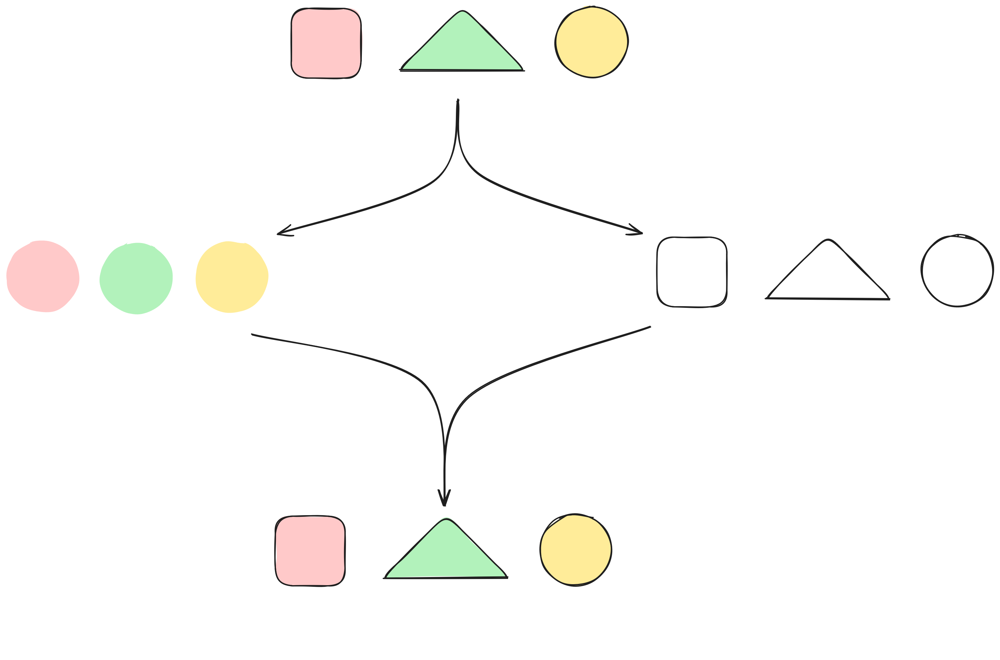

# Never alone

"So, I gave it some thoughts" Jules started, "since we said that we cannot do anything alone, we could add what I would call an obeserver in order to be able to work with the root CA".

"That's a nice idea but it won't solve the issue because we have nothing that enforce it. If someone wants to do it alone, nothing stops them." Adira said.

"True" Leiko approuved, "but we could share the secrets necessary to access it. For exemple Jules would be the only one to know the code of the safe and Adira would be the only one to know the password of the root CA."

"Smart!" Adira remarked.

"But if any one of us has any issue, then we loose access to the root CA!" Jules said, remembering the Himalaya's incident.

"Then we should use the Shamir's Secret Sharing algorithm" Shuri said.

Seeing that everybody was giving her a puzzled look, she continued: "The Shamir Shared Secret algorithm allows us to share a secret between people while needing only a subset of thoses people to retrieve it."

Every one kept their poker face.

"Let's say you have a secret, like the password to the root CA, that you want to keep safe. You also want to make sure that two people are here in order to access the secret. You can divide it in two and give one half to each of them. Let me draw you an exemple."

"Let's say the secret is red square, green triangle, yellow circle. We can give to Jules the information red green and yellow, and to Adira, square triangle circle. When they meet, they can rebuild the secret."

"So far, that's basically the same thing as what Leiko proposed" Adira said.

"So far, yes. It only adds the benefit of being scalable to any number of shares. If we want to split the key in four in order to all have a share, we could." Shuri replied.

"Ok, this part seems simple enough, but something tells me there is a catch." Jules said.

"Indeed. Let me draw something slightly different" Shuri replied.

"Now, I split the share in three, but I give a little bit more information to everyone. For exemple, the first share shows that the first element is a red square, the second one is green and the third one is a circle. That way, only two people are necessary to rebuild the secret. And that's true for any two pairs."

"I see!" Jules said, "And that way, even if one share is not accessible, you still can get access to the secret."

"Exactly, when we have enough people to get the secret, we say we have a quorum." Shuri added.

"But giving that much of the secret to each person is going to make brute forcing the secret easier isn't it?" Adira asked.

"That's where Shamir's Secret Sharing algorithm is brillant. It doesn't embed any information about the secret in the shares. The maths are complex but just consider it's the same idea with perfect secrecy added. Thus, we can safely share the secret between any number of people as well as choose the size of our quorum." Shuri replied.

"That's awesome!" Leiko said, "But getting access to the root CA start to get a bit complicated. We should document how to do it as well as keep track of who has a share."

"Perfect! Let's do all of this! Let's all have a share, including Vernes and set a quorum to a size of two." Jules said, enthusiastic.

"But how?" Leiko asked.

"[Hashicorp vault](https://www.hashicorp.com/en/products/vault) is a solution that uses the Shamir's Secret Sharing algorithm. Even better, it can handle PKIs so we won't have any openssl command to handle." Shuri replied.

"Nice! I'll setup the offline computer with that." Adira said.

After three years of uninterrupted success, Adira enters Jules office, panic clearly readable on her face.

"What? What happenned?" Jules asked.

"We lost access to the root CA!" Adira replied.

"What? How?" Jules asked.

"It seems the hard drive died! I even tried to plug it to another computer to recover data. Nothing works. I can't read anything from it." Adira said.

Jules said nothing, not knowing if he should yell from anger or cry from sadness. Evil Corp is going to be delighted to exploit this issue to get as much market share as possible. Hole-in-one will probably not recover from this.

After a minute or two that seemed like hours to Adira, Jules finally calmly said "You did everything you could. Let me see how I can do some damage control."

That evening, Jules decided to go back in time again. At that rythm, past Jules is going to receive an email from future Jules everyday...

