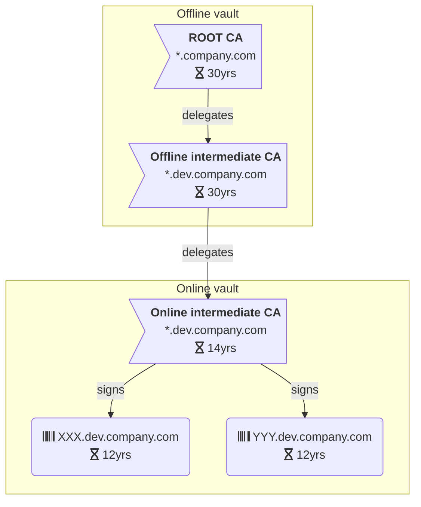

Following the recommendations given in [the O.R.CA documentation](https://github.com/eove/orca), here is a schema of our PKI :

```mermaid
flowchart TD

    subgraph Offline vault
        ROOT_CA>"<b>ROOT CA</b>
*.company.com
fa:fa-hourglass 30yrs"]
        INTERMEDIATE_CA>"<b>Offline intermediate CA</b>
*.dev.company.com
fa:fa-hourglass 30yrs"]
    end
    ROOT_CA --> |delegates| INTERMEDIATE_CA

    INTERMEDIATE_CA --> |delegates| VAULT_PKI

    subgraph Online vault
        VAULT_PKI>"<b>Online intermediate CA</b>
*.dev.company.com
fa:fa-hourglass 14yrs"]
        VAULT_PKI -->|signs| EOCON1("fa:fa-barcode XXX.dev.company.com
fa:fa-hourglass 12yrs")
        VAULT_PKI -->|signs| EOCON2("fa:fa-barcode YYY.dev.company.com
fa:fa-hourglass 12yrs")
    end
```
