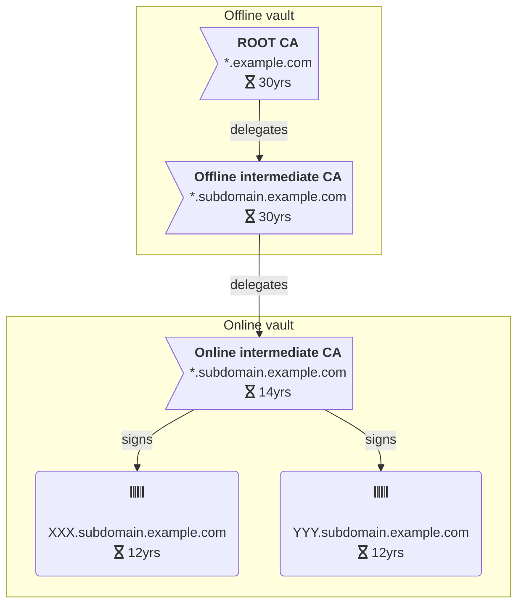

One of the key feature of the vault system is to handle a Public-Key Infrastructure (PKI).

The whole chain of trust starts with the root Certificate Authority (CA). That's why it must be kept as secured as possible.

To achieve this, the PKI (and thus the vault system) is split in two parts:
 - the offline CAs, that contain multiple CAs, one of them is the root CA (topmost root of trust).  
   All of these offline CAs are manipulated using the offline vault.  
   The offline vault is not a machine, it is a database (a set of backup files) fetched into an ephemeral machine when manipulating the online CAs.
 - the online CAs which are used on a daily basis.  

In the offline vault, the root CA delegates its signing rights to offline intermediate CAs that are restricted to a given subdomain.
This offline intermediate CA will then delegate its signing rights to an online intermediate CA that is valid for a short amount of time.
It is up to the online intermediate CA to sign certificates on a day to day basis.

Here is a graphical representation of the chain of trust:

